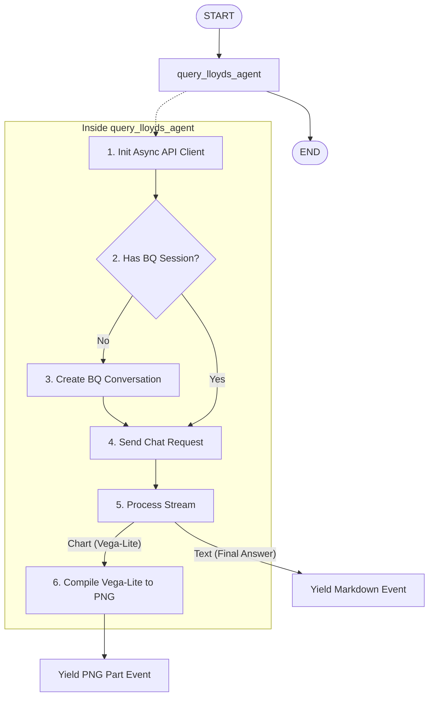

# 📊 Lloyds Wrapped Conversational Data Agent (ADK 2.0)

This repository contains a state-of-the-art **Conversational Analytics Agent** built using **Google ADK 2.0** and integrated with the new **BigQuery Conversational Analytics API**. 

The agent provides a natural language chat interface to explore, analyze, and visualize customer transaction data, app engagement trends, and cashback rewards from Lloyds banking datasets. It automatically compiles complex data visualizations generated by the BigQuery agent into high-quality inline images on the fly.

---

## 🏗️ Architecture Overview

The application is structured around a **Graph-based Workflow** (the new standard in ADK 2.0), rather than legacy class-based orchestration.



The workflow is defined in `agent.py` and mounted as the module-level `root_agent` variable, which the `adk web` runner automatically discovers and runs:

```python
root_agent = Workflow(
    name="lloyds_wrapped_workflow",
    edges=[
        ("START", query_lloyds_agent)
    ]
)
```

---

## 🔌 Conversational Analytics API Integration (In-Depth)

The core logic of the agent is contained in the `query_lloyds_agent` function. Here is a detailed breakdown of how it interacts with the BigQuery Conversational Analytics API.

### 1. Endpoint Resolution & Async Client Initialization
Because the BigQuery agent is deployed in the multi-region location `us`, the API requires communicating with a location-specific regional endpoint. We initialize the asynchronous client with the target endpoint `geminidataanalytics.us.rep.googleapis.com`:

```python
from google.cloud import geminidataanalytics
from google.api_core import client_options

location = "us"
endpoint = f"geminidataanalytics.{location}.rep.googleapis.com"
opts = client_options.ClientOptions(api_endpoint=endpoint)

# Async client for non-blocking stream handling
client = geminidataanalytics.DataChatServiceAsyncClient(client_options=opts)
```

We use `DataChatServiceAsyncClient` instead of the synchronous counterpart. This ensures that when we stream response chunks from Google Cloud, we do not block the ASGI/FastAPI event loop, keeping the ADK Web UI highly responsive.

### 2. Stateful Session Management
The BigQuery Conversational Analytics API supports native **stateful conversations** where the cloud backend manages and remembers the chat history. To utilize this, our ADK agent performs the following lifecycle check on every user turn:

```python
# 1. Check if we already have a BigQuery conversation resource for this ADK session
bq_conversation_name = ctx.state.get("bq_conversation_name")

if not bq_conversation_name:
    # 2. Generate a unique conversation ID
    conversation_uuid = str(uuid.uuid4())
    conversation_id = f"conv-{conversation_uuid}"
    
    # 3. Define the conversation resource pointing to our Data Agent
    conversation = geminidataanalytics.Conversation()
    conversation.agents = [f"projects/{billing_project}/locations/{location}/dataAgents/{data_agent_id}"]
    conversation.name = f"projects/{billing_project}/locations/{location}/conversations/{conversation_id}"
    
    # 4. Create the conversation in the Google Cloud project
    create_request = geminidataanalytics.CreateConversationRequest(
        parent=f"projects/{billing_project}/locations/{location}",
        conversation_id=conversation_id,
        conversation=conversation,
    )
    conversation_resource = await client.create_conversation(request=create_request)
    
    # 5. Persist the BQ conversation resource name in the ADK session state
    bq_conversation_name = conversation_resource.name
    yield Event(state={"bq_conversation_name": bq_conversation_name})
```

*   **ADK Session State (`ctx.state`)**: We store the created conversation's resource name (`bq_conversation_name`) in the persistent ADK session state.
*   **Persistent Turn-taking**: On subsequent user messages, `bq_conversation_name` is retrieved from `ctx.state`, skipping the creation step. The API automatically loads the conversation history from the cloud backend, enabling seamless multi-turn reasoning.

### 3. Executing the Stateful Chat Request
Once the session is established, we construct and dispatch a `ChatRequest` containing only the new user message and the conversation reference:

```python
# Wrap the user input in a Message object
messages = [geminidataanalytics.Message()]
messages[0].user_message.text = node_input

# Reference the existing conversation resource
conversation_reference = geminidataanalytics.ConversationReference()
conversation_reference.conversation = bq_conversation_name
conversation_reference.data_agent_context.data_agent = f"projects/{billing_project}/locations/{location}/dataAgents/{data_agent_id}"

chat_request = geminidataanalytics.ChatRequest(
    parent=f"projects/{billing_project}/locations/{location}",
    messages=messages,
    conversation_reference=conversation_reference,
)

# Call the streaming chat endpoint
stream = await client.chat(request=chat_request)
```

---

## 🎨 Stream Processing & Vega-Lite Image Rendering

The response returned by `client.chat` is an asynchronous stream of `Message` packets. We iterate over this stream and parse the system message chunks.

### 1. Smart Response Filtering (Thoughts vs. Answers)
The API populates the `'textType'` field in its text payloads, which we convert to a dictionary using `MessageToDict` for robust access:

```python
async for response in stream:
    sys_msg = response.system_message
    if not sys_msg:
        continue
        
    sys_msg_dict = MessageToDict(sys_msg._pb)
    
    if "text" in sys_msg_dict:
        text_info = sys_msg_dict["text"]
        text_parts = text_info.get("parts", [])
        text_content = "".join(text_parts)
        text_type = text_info.get("textType", "FINAL_RESPONSE")
        
        # We only yield the FINAL_RESPONSE to the user to keep the UI clean,
        # skipping internal 'THOUGHT' (reasoning) steps.
        if text_type == "FINAL_RESPONSE":
            yield Event(message=text_content)
        elif text_type == "FOLLOWUP_QUESTIONS":
            # Suggested questions are appended at the bottom as clickable suggestions
            followups_md = "\n\n**Suggested Questions:**\n" + "\n".join(f"- {q}" for q in text_parts)
            yield Event(message=followups_md)
```

### 2. Live Vega-Lite to PNG Compilation
When the BigQuery agent generates a visualization, it doesn't return a static image file. Instead, it returns a **Vega-Lite JSON specification** under the `chart` key. 

To display this chart on the ADK Web UI, we compile the Vega-Lite specification into a PNG image entirely in memory on the fly:

```python
if "chart" in sys_msg_dict:
    chart_info = sys_msg_dict["chart"]
    vega_config = chart_info.get("result", {}).get("vegaConfig")
    if vega_config:
        try:
            # 1. Load the Vega-Lite dict into Altair
            chart = alt.Chart.from_dict(vega_config)
            
            # 2. Compile the chart spec into a PNG byte stream in-memory
            buf = io.BytesIO()
            chart.save(buf, format='png')
            image_bytes = buf.getvalue()
            
            # 3. Wrap the compiled PNG bytes in a GenAI Part object
            part = types.Part.from_bytes(data=image_bytes, mime_type="image/png")
            
            # 4. Yield the Part to the ADK Event stream
            yield Event(content=types.Content(parts=[part]))
        except Exception as chart_err:
            yield Event(message=f"\n*(Error rendering visualization: {chart_err})*\n")
```

*   **Altair + `vl-convert-python`**: By installing `vl-convert-python` in the virtual environment, Altair compiles the Vega-Lite JSON into a PNG image instantly in pure Python. No headless browsers (like Selenium or Chrome) or external subprocesses are spawned.
*   **Multimodal Part Yielding**: ADK 2.0's Web UI natively supports rendering multimodal `Part` items. When we yield a part with `mime_type="image/png"`, the Web UI automatically renders it as an inline image in the chat feed.

---

## 🛠️ Local Running & Verification

If you are already in the project directory with dependencies installed:

1.  **Start the ADK Web Server**:
    Launch the FastAPI-based web server using the `uv` runner:
    ```bash
    uv run adk web --port 8000 ./
    ```
2.  **Access the Web UI**:
    Open your browser and navigate to:
    **[http://localhost:8000](http://localhost:8000)**
3.  **Verify the Flow**:
    Type `Create a bar chart showing the total spending by customer.` and verify that the bar chart renders natively inline.

---

## 🌐 Remote Setup & Cloning Guide

To clone this repository and set up this Conversational Analytics Agent on a new machine or cloud environment, follow this step-by-step guide.

### 1. Prerequisites
Ensure you have the following installed on your system:
*   **Python 3.12+**
*   **Git**
*   **`uv`**: A fast Python package installer and resolver.
    *   *To install `uv`*:
        ```bash
        pip install uv
        ```
        *(Or use the official installer: `curl -LsSf https://astral.sh/uv/install.sh | sh`)*
*   **Google Cloud SDK (`gcloud` CLI)**: To authenticate your environment.

### 2. Clone the Repository
Clone the repository to your remote environment and navigate into the folder:
```bash
git clone <your-github-repository-url>
cd lloydsteam6
```

### 3. Initialize Virtual Environment & Install Dependencies
Use `uv` to initialize the project environment and install the required packages. This will automatically set up the virtual environment (`.venv`):
```bash
# Initialize project environment
uv venv

# Install ADK, Conversational Analytics client, and Altair chart rendering packages
uv add google-adk google-cloud-geminidataanalytics altair vl-convert-python pandas
```
> [!NOTE]
> Installing `vl-convert-python` is **critical**. It allows Altair to compile Vega-Lite specifications directly to PNG images in Python, bypassing the need to install a headless browser (like Chrome or Selenium) on your system.

### 4. Authenticate with Google Cloud
The agent relies on your local Application Default Credentials (ADC) to interact with both the BigQuery Conversational Analytics API and the Vertex AI platform.

1.  **Authenticate your gcloud CLI**:
    ```bash
    gcloud auth login
    ```
2.  **Authenticate Application Default Credentials (ADC)**:
    ```bash
    gcloud auth application-default login
    ```
3.  **Configure your target Google Cloud Project**:
    Set the active project to the one containing the BQ agent:
    ```bash
    gcloud config set project edb-hack2026-team6
    ```

> [!IMPORTANT]
> **Avoid Credential Mismatches (Gcloud vs. ADC)**:
> In Google Cloud development, Python libraries (like the ADK agent) use the identity configured in your **ADC file** (`~/.config/gcloud/application_default_credentials.json`), **not** your active `gcloud config` CLI account.
> 
> If you encounter errors like `No API key was provided` or `403 Permission Denied (aiplatform.endpoints.predict)`, it is highly likely that your ADC file is pointing to a different/legacy Google account (e.g. an external or personal domain) instead of your active workshop/organization account. To resolve this, run `gcloud auth application-default login` and authenticate with the **exact same account** that owns the Google Cloud project.

### 5. IAM Permissions Checklist
Ensure that the Google Cloud identity configured in your Application Default Credentials (ADC) has the following IAM roles assigned in the project `edb-hack2026-team6`:
1.  **`roles/aiplatform.user`** (Vertex AI User): **Critical**. Required by the `classifier_agent` and `search_agent` to invoke foundation models (like `gemini-2.5-flash`) on the Vertex AI platform.
2.  **`roles/geminidataanalytics.dataAgentOwner`** (Gemini Data Analytics Data Agent Owner): Required to query the Conversational Analytics API, create stateful conversations, and read the data agent's configuration.
3.  **`roles/cloudaicompanion.user`** (Gemini for Google Cloud User): Required to authorize interactions with the Gemini companion infrastructure.
4.  **`roles/bigquery.dataViewer`** and **`roles/bigquery.jobUser`**: Required because the Conversational Analytics API queries the underlying BigQuery tables (such as `banking_wrapped.customers` and `banking_wrapped.transactions`) using your credentials.


### 6. Verify Configuration
Ensure the constants in the top section of `query_lloyds_agent` in `agent.py` match your target deployment:
*   `billing_project = "edb-hack2026-team6"`
*   `location = "us"`
*   `data_agent_id = "agent_8f5e5cf8-79bf-4095-87d1-08477f4a668b"`

### 7. Run the Web Server
Once setup is complete, spin up the server:
```bash
uv run adk web --port 8000 ./
```
If you are connected to the environment via SSH, you can access the Web UI from your local machine by establishing an SSH port forward:
```bash
ssh -L 8000:localhost:8000 your-remote-hostname
```
Then, open your local browser to **[http://localhost:8000](http://localhost:8000)** and start chatting!

